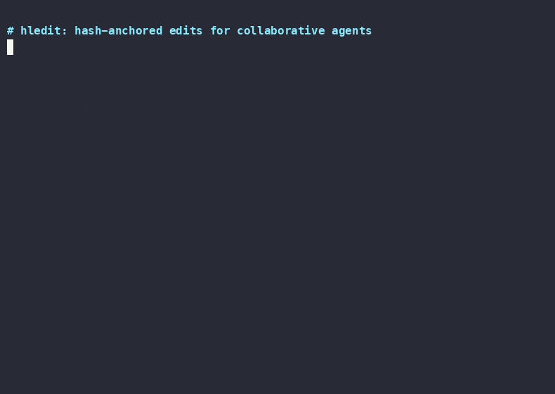

# hledit

`hledit` is a tiny hash-anchored line editor for AI coding agents.

Instead of asking an agent to reproduce old text exactly, `hledit read` annotates each line with a stable anchor:

```text
5#HY:func main() {
6#MX:    fmt.Println("hello")
7#NP:}
```

Write commands reference anchors such as `6#MX`. Before changing the file, `hledit` recomputes the hash at that line. If the file changed since it was read, the anchor is rejected and no write happens.

## Why

Traditional text-matching edits fail silently when a file shifts between read and write. `hledit` fails loud on stale anchors so agents patch the right line or stop.

Built for AI coding agents: small local tools, typed inputs, deterministic text output, bounded context, and explicit failure modes.

## Demo



Recorded terminal demo source: [`docs/demo/hledit.cast`](docs/demo/hledit.cast)

Play locally:

```bash
asciinema play docs/demo/hledit.cast
```

The demo shows:

- `hledit read` producing `LN#ANCHOR` references
- another actor changing the target line
- stale edit rejection with `{"ok":false,"error":"stale"}`
- re-read with fresh anchor
- successful edit after anchor refresh

## Install

`hledit` is a standalone CLI. You do not need Pi or `pi-hledit` to use it.

## Requirements

- Go 1.21+
- A POSIX-like shell for the examples
- Pi is optional; only needed for `pi-hledit`

### Option 1: install with Go

```bash
go install github.com/dabito/hledit@latest
```

Go installs the binary into `$GOBIN`, or `$GOPATH/bin` when `GOBIN` is unset. For a default Go setup, that is usually:

```text
$HOME/go/bin/hledit
```

Recommended: add Go's bin directory to your shell `PATH`:

```bash
export PATH="$HOME/go/bin:$PATH"
hledit --version
```

To make that persistent, add it to your shell startup file, for example:

```bash
# zsh (macOS default)
echo 'export PATH="$HOME/go/bin:$PATH"' >> ~/.zshrc

# bash
echo 'export PATH="$HOME/go/bin:$PATH"' >> ~/.bashrc
```

Optional: if an integration specifically looks in `~/.local/bin`, create a compatibility symlink. The `mkdir -p` line is only there to create the directory if it does not already exist:

```bash
mkdir -p "$HOME/.local/bin"
ln -sf "$HOME/go/bin/hledit" "$HOME/.local/bin/hledit"
```

You do not need the symlink for normal CLI use when `$HOME/go/bin` is on `PATH`.

### Option 2: build from source

For local development, build into `dist/` and symlink into `~/.local/bin`:

```bash
make install
```

Override the target bin directory if needed:

```bash
make install LOCAL_BIN="$HOME/bin"
```

Build without installing:

```bash
make build
# writes dist/hledit
```

## Development

```bash
go test ./...
go vet ./...
make check
```

## Optional Pi integration

The Pi extension is a separate package: [`pi-hledit`](https://github.com/dabito/pi-hledit). It wraps this CLI but is not required to use `hledit` directly.

Install the extension after installing the CLI:

```bash
pi install npm:pi-hledit
```

Reload Pi:

```text
/reload
```

The extension registers a single `hledit` tool with an `op` parameter (`read`, `edit`, `batch`). It uses `~/.local/bin/hledit` by default. If your binary lives elsewhere, either keep that directory on Pi's `PATH` or set:

```bash
export HLEDIT_BIN="$HOME/go/bin/hledit"
```

## Optional MCP integration

The MCP server is a separate package: [`hledit-mcp`](https://github.com/dabito/hledit-mcp). It wraps this CLI for MCP-compatible clients such as Claude Code, Claude Desktop, and Cursor.

Install after installing the CLI:

```bash
claude mcp add hledit npx hledit-mcp
```

## Commands

```text
hledit read <file> [--grep pattern] [--context N] [--json] [--pretty]
hledit read-range <file> [--offset N] [--limit M] [--grep pattern] [--context N] [--json] [--pretty]
hledit anchors <file> [--offset N] [--limit M] [--grep pattern] [--context N] [--json] [--pretty]
hledit replace <file> <anchor> <content-source>
hledit replace-range <file> <anchor> <end-anchor> <content-source>
hledit insert [--before|--after] <file> <anchor> <content-source>
hledit batch [--check] <file>
```

`--grep` matches substrings. `--context N` adds N lines before/after each match. `--pretty` adds ANSI styling for human reading; `--json` stays machine-readable and unstyled.
`<content-source>` is either `-` for stdin or a file path.

## Examples

Read a file:

```bash
hledit read main.go
```

Read a window of a large file:

```bash
hledit read-range main.go --offset 40 --limit 20

Read styled output for humans:

```bash
hledit read main.go --pretty
```
```

Replace one line using stdin:

```bash
printf '    fmt.Println("hello world")\n' | hledit replace main.go 6#MXL -
```

Replace a range using a prepared file:

```bash
hledit replace-range main.go 12#NKA 18#VRC /tmp/new-block.txt
```

Insert before or after an anchor:

```bash
cat header.txt | hledit insert --before main.go 1#QVE -
printf '// done\n' | hledit insert --after main.go 99#TXA -
```
Apply multiple edits atomically with JSON on stdin:

```bash
printf '%s\n' '{"edits":[{"op":"replace","pos":"12#NKA","end_pos":"18#VRC","lines":["new block"]},{"op":"insert","pos":"22#VRB","lines":["// inserted"]}]}' | hledit batch main.go
echo '{"edits":[{"op":"replace","pos":"12#NKA","lines":["fixed"]}]}' | hledit batch --check main.go
```
Delete a line or range by piping empty stdin and using `-` as the content source:

```bash
printf '' | hledit replace main.go 6#MXL -
printf '' | hledit replace-range main.go 12#NKA 18#VRC -
```

## Output

Read emits `LN#HASH:TEXT`; anchors emits `ANCHOR<TAB>TEXT`.
`--json` emits `{ok, lines:[{line,anchor,text}], truncated, nextOffset}`.

```text
1#QVE:package main
2#2CF:
3#V33:import "fmt"
```

Write commands emit JSON:

```json
{"ok":true,"firstChangedLine":6,"lastChangedLine":6}
```

Batch adds `editsApplied`; `--check` also adds `checked:true`.

```json
{"ok":true,"firstChangedLine":2,"lastChangedLine":4,"editsApplied":2,"checked":true}
```

Stale anchors are rejected atomically:

```json
{
  "ok": false,
  "error": "stale",
  "message": "anchor 6#MXL: stale",
  "remaps": [{"requested":"6#MXL","current":"6#MQA"}]
}
```

## Hash format

Anchors are `LN#HASH`:

- `LN` is the 1-indexed line number.
- `HASH` is a 3-character content hash. Legacy 2-character hashes are accepted for writes.
- The default hash uses FNV-1a 32-bit, normalized trailing whitespace, and uppercase base32 alphabet `ABCDEFGHJKLMNPQRSTUVWXYZ23456789` (drops `0/O` and `1/I`, keeps `L`).
- Blank or punctuation-only lines mix the line number into the hash so identical structural lines are easier for models to distinguish.

### Collision model

`LN#HASH` is a stale-context guard, not a cryptographic content ID. The line number narrows the check to the target line; the short hash catches ordinary stale edits while keeping anchors compact enough for agents to copy reliably. A hash collision on the same line is possible, so `hledit` does not claim perfect hashing or that corruption is impossible. If an edit returns `stale`, re-read and retry with the fresh anchor.

## Behavior notes

- Writes are atomic: temp file + rename.
- All anchors in a write are validated before writing.
- Logical failures (`stale`, `invalid`, `binary`, `range`, `io`) are reported as JSON on stdout.
- CLI misuse exits `2`; unrecoverable infrastructure failures exit `1`; normal logical outcomes exit `0`.

## Failure modes

- stale anchor -> re-read and retry
- binary file -> stop and use a text file
- invalid anchor or CLI misuse -> fix args
- I/O error -> check path and permissions
- text `read` output may append a truncation sentinel; use `--json` for machine parsing

## When not to use it

- binary files
- minified or positional-only edits where anchors add no value
- workflows that need fuzzy matching instead of stale-safe rejection

## Credits and prior art

The core hashline-edit idea comes from Can Bölük / @can1357's work on coding-agent harnesses, especially [“I Improved 15 LLMs at Coding in One Afternoon. Only the Harness Changed.”](https://blog.can.ac/2026/02/12/the-harness-problem/) and [`oh-my-pi`](https://github.com/can1357/oh-my-pi). Read that article for the deeper technical rationale and benchmark discussion.

This repo is intentionally narrower:

- standalone stdlib Go CLI, not a full agent harness;
- stable JSON outputs for agent/tool integration;
- deterministic stale-checking edits with no fuzzy matching;
- Pi integration kept separate in [`pi-hledit`](https://github.com/dabito/pi-hledit).

Additional prior art: [`aron/hashline`](https://github.com/aron/hashline), a reference Go implementation/spec for hash-anchored line editing.

## Project docs

- [`PRD.md`](./PRD.md) — product requirements
- [`SPEC.md`](./SPEC.md) — implementation contract
